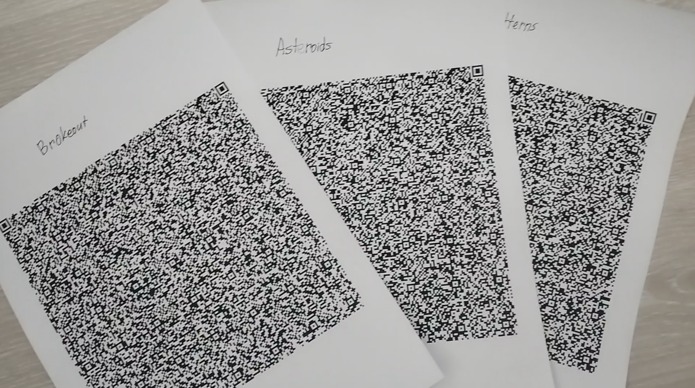
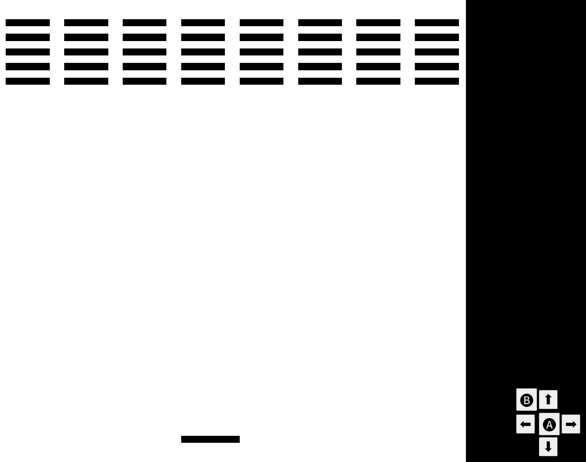

# qrboy
a tiny game console architecture + emulator that fits entire games on a QR code

> note: if you're here just for the games, head over to the `games/` directory and see the [running](#running) section!

## what is this?
this is an imaginary console and its emulator that fits, along with the game, on a single qr code. it uses a `data:` URL to load the game in a browser.

## running
on iPhone, i have no clue haha, feel free to let me know if you find a working solution!

on Android, you can use Google Lens (likely preinstalled) to scan the QR codes, which will give you the option to copy their contents, or use the [Binary Eye](https://play.google.com/store/apps/details?id=de.markusfisch.android.binaryeye&hl=en) app which will do the same but more efficiently and reliably. then, copy the `data:` URL and paste it in your browser of choice (make sure not to search it!) and enjoy!!

## developing
`git clone` this project, then do `npm i . -g` (make sure npm is instaled!) from the project directory. now you can compile programs from sembly, my own assembly-like language, using `qrcode-sembly`.

see the `docs/` directory for basic documentation and `examples/` for examples.

knowing CHIP-8 development helps! go learn that first if you don't get it, it's also pretty easy and is supported way better by its community